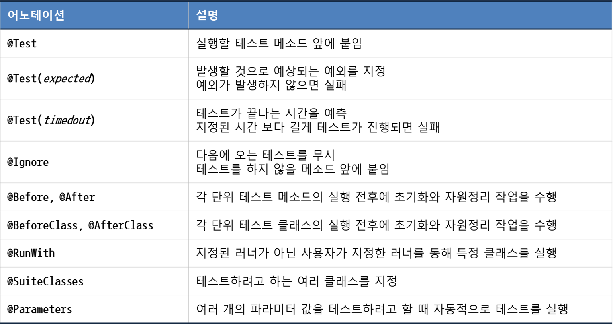
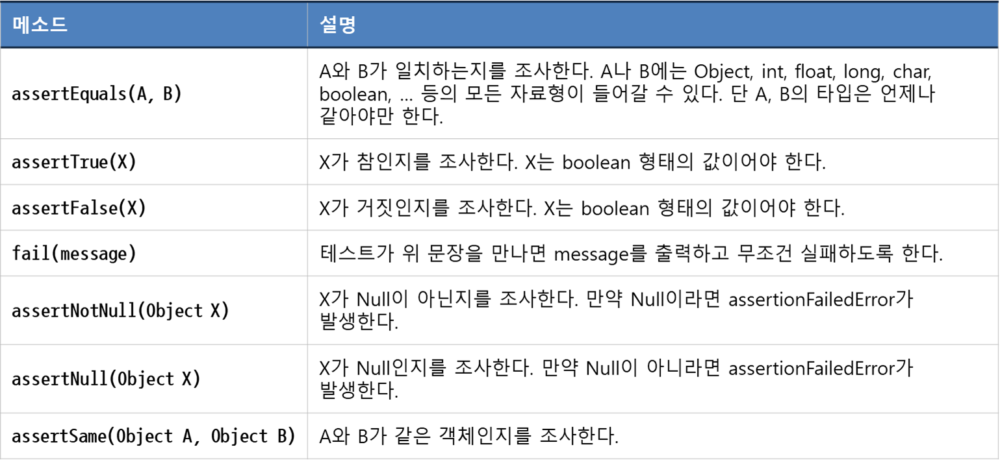

## TDD(Test Driven Development)

### JUnit

- 1997년에 만들어진 자바 기반의 단위 테스트 프레임 워크
- 단위 테스트 결과를 실패(붉은색), 성공(녹색) 중 하나로 표시

### JUnit Annotation

### JUnit Method

## TDD연습
> factorial = 팩토리얼 = 계승  
> - 그 수 보다 작거나 같은 모든 양의 정수의 곱
> - 음이 아닌 정수 n의 계승 = n! = 1 x 2 x 3 x … x n
> - 0의 계승 = 0! = 1
> 

