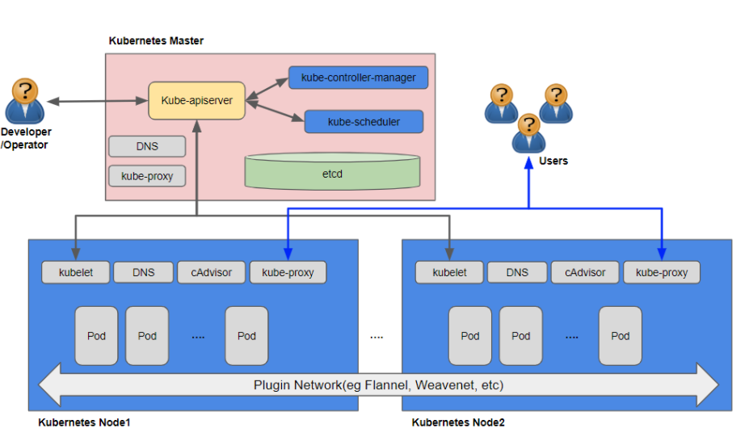

## 쿠버네티스 동작 과정(원리) 및 컴포넌트 종류와 구성

### 작동원리(base on 파드 생명 주기)
1. kubectl을 통해 API서버에 파드 생성을 요청
2. (업데이트가 있을 때 마다 매번)API 서버에 전달된 내용이 있으면 API서버는 etcd에 전달된 내용을 모두 기록해 클러스터의 상태 값을 최신으로 유지한다. 따라서 각 요소가 상태를 업데이트 할 때 마다 모두 API서버를 통해 etcd에 기록된다.
3. API 서버에 파드 생성이 요청된 것을 컨트롤러 매니저가 인지하면 컨트롤러 매니저는 파드를 생성하고, 이 상태를 API서버에 전달한다. (어떤 워커 노드에 파드를 적용할지는 결정되지 않은 상태로 파드만 생성)
4. API서버에 파드가 생성됐다는 정보를 스케줄러가 인지한다. 스케줄러는 생성된 파드를 어떤 워커 노드에 적용할지 조건을 고려해 결정하고 해당 워커 노드에 파드를 띄우도록 요청한다.
5. API서버에 전달된 정보대로 지정한 워커 노드에 파드가 속해있는지 스케줄러가 kubectl으로 확인한다.
6. kubelet에서 컨테이너 런타임으로 파드 생성을 요청한다.
7. 파드가 생성된다.
8. 파드가 사용 가능한 상태가 된다. 
#### 쿠버네티스는 workflow구조(작업을 순서대로 진행하는 방식)가 아니라 선언적인(declarative)시스템 구조를 가지고 있다. 즉 각 요소가 추구하는 상태를 선언하면 현재 상태와 맞는 지 점검하고 그것에 맞추려고 노력하는 구조하는 것.
 

### 컴포넌트 종류와 구성
#### 마스터노드
1. API서버: 쿠버네티스 API를 사용하도록 요청을 받고 요청이 유효한지 검사한다. 즉 쿠버네티스 클러스터에 명령을 내리는 역할을 한다.
2. etcd: 쿠버네티스의 모든 구성 요소들의 상태값이 저장되는 곳으로 분산 저장이 가능한 key-value 타입의 저장소이다. 그러므로 etcd를 복제해서 여러 곳에 저장해두면 하나의 etcd에서 장애가 나더라고 시스템의 가용성을 확보할 수 있다.
3. controller manager: 파드를 관찰하며 개수를 보장하는 역할(오브젝트 상태 관리)을 한다. 
4. scheduler: 파드를 실행할 노드를 선택한다. 노드의 상태와 자원, 레이블, 요구 조건 등을 고려해서 어떤 worker node에 생성할 것인 지를 결정하고 할당한다. 

#### 워커 노드
1. kubelet: 모든 노드에서 실행되는 쿠버네티스 에이전트로 데몬 형태로 동작한다. 파드의 구성내용을 받아서 컨테이너 런타임으로 전달하고, 파드 안의 컨테이너들이 정상적으로 작동하는 지 모니터링하는 역할
2. CRI(컨테이너 런타임): 컨테이너를 실행하는 엔진으로 docker, containerd, runc가 있다. 
3. kube-proxy: 쿠버네티스의 network 동작을 관리하고 iptables rule을 구성한다. 
4. pod: 한 개 이상의 컨테이너로 단일 목적의 일을 하기 위해서 모인 단위이다. 즉, 웹서버 역할, 로그나 데이터 분석 역할 등 다양하다. 중요한 것은 pod는 언제라도 죽을 수 있는 존재라는 것이다. 

참고자료
 

*  [TTABAE-LEARN 유튜브 중 따배쿠 시리즈](https://www.youtube.com/watch?v=Iue9TC13vPQ&list=PLApuRlvrZKohaBHvXAOhUD-RxD0uQ3z0c&index=7)
* [컨테이너 인프라 환경 구축을 위한 쿠버네티스/도커 도서](http://www.kyobobook.co.kr/product/detailViewKor.laf?ejkGb=KOR&mallGb=KOR&barcode=9791165215743)

