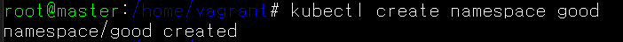
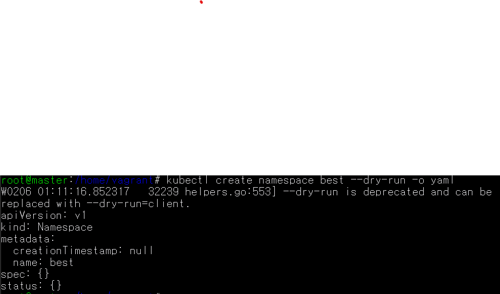
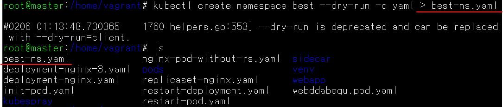
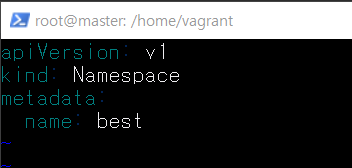
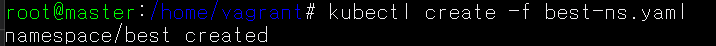
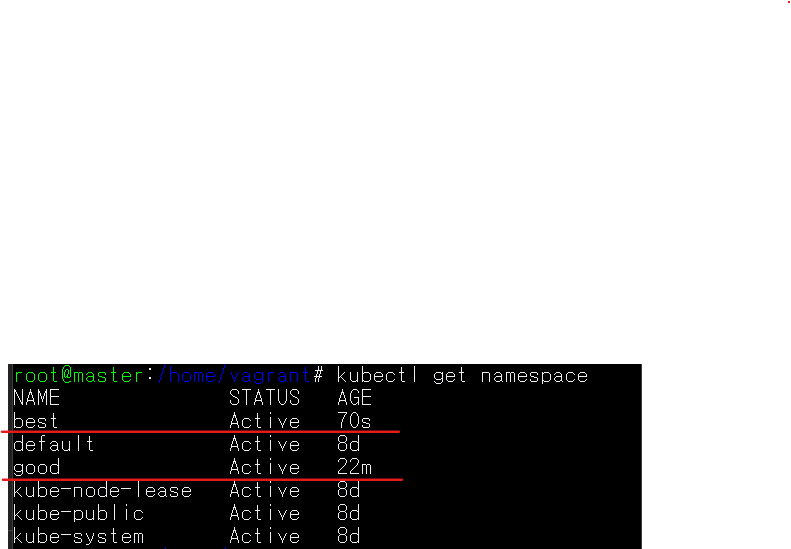
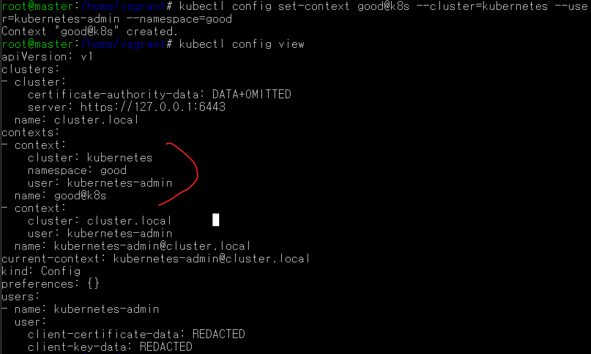
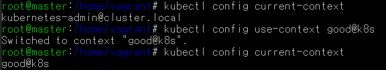

## namespace란 무엇인가?: 리소스를 논리적으로 구분하는 장벽
- 클러스터 안의 가상 클러스터 - 포드, 레플리카셋, 디플로이먼트, 서비스와 같은 쿠버네티스 리소스들이 묶여있는 하나의 가상 공간 또는 그룹
- k8s API 종류 중 하나
- 쿠버네티스 클러스터에서 사용되는 리소스들을 구분해 관리하는 그룹이다. 
    - 클러스터 하나를 여러 개의 논리적인 단위로 나눠서 사용: *API를 여러개인 것 처럼 사용하는 것*
    - 쿠버네티스 클러스터 하나를 여러 팀이나 사용자가 함꼐 공유
    - 용도에 따라 실행해야하는 앱을 구분할 때 사용

*장점: 수 많은 동작 중인 파드 중에서 원하는 네임스페이스의 파드들만 따로 관리하기 편함*

## 초기 네임스페이스
```
$ kubectl get namespace

NAME              STATUS   AGE
default           Active   11d	⇐ 기본 네임스페이스 (네임스페이스를 지정하지 않으면 기본 네임스페이스를 사용)
kube-node-lease   Active   11d	⇐ 쿠버네티스 노드의 가용성을 체크하기 위한 네임스페이스 
kube-public       Active   11d	⇐ 인증받지 않은 사용자를 포함한 모든 사용자가 읽기 권한으로 접근이 가능 
					   쿠버네티스 클러스를 위한 예약된 공간 
kube-system       Active   11d	⇐ 쿠버네티스 클러스터의 리소스가 배치되는 네임스페이스 
```

<br>


## namespace 생성하기
### 1. Use CLI 

``` 
$ kubectl create namespace good
$ kubectl get namespaces
```


### 2. Use yaml

``` 
$ kubectl create namespace best --dry-run -o yaml>best-ns.yaml 
// --dry-run: 실제로 실행하지 않고 실행 가능 여부만 확인
// -o yaml: 실행결과를 yaml 파일로 출력 
$ vi best-ns.yaml
$ kubectl create -f best-ns.yaml
```






## Base namespace switch
### 기본으로 사용하는 namespace를 default가 아닌 다른 이름의 namespace로 switch

<br>

1. namespace를 포함한 context를 등록

``` 
$ kubectl config --help //도움말 확인
$ kubectl config set-context NAME --cluster=kubernetes...
$ kubectl config view
```


2. 등록된 namespace로 context 변경

``` 
$ kubectl config use-context NAME
```


## 네임스페이스에 속하는 오브젝트
```
root@master:/home/vagrant# kubectl api-resources --namespaced=true

NAME                        SHORTNAMES   APIGROUP                    NAMESPACED   KIND
bindings                                                             true         Binding
configmaps                  cm                                       true         ConfigMap
endpoints                   ep                                       true         Endpoints
events                      ev                                       true         Event
limitranges                 limits                                   true         LimitRange
persistentvolumeclaims      pvc                                      true         PersistentVolumeClaim
pods                        po                                       true         Pod
podtemplates                                                         true         PodTemplate
replicationcontrollers      rc                                       true         ReplicationController
resourcequotas              quota                                    true         ResourceQuota
secrets                                                              true         Secret
serviceaccounts             sa                                       true         ServiceAccount
services                    svc                                      true         Service
controllerrevisions                      apps                        true         ControllerRevision
daemonsets                  ds           apps                        true         DaemonSet
deployments                 deploy       apps                        true         Deployment
replicasets                 rs           apps                        true         ReplicaSet
statefulsets                sts          apps                        true         StatefulSet
localsubjectaccessreviews                authorization.k8s.io        true         LocalSubjectAccessReview
horizontalpodautoscalers    hpa          autoscaling                 true         HorizontalPodAutoscaler
cronjobs                    cj           batch                       true         CronJob
jobs                                     batch                       true         Job
leases                                   coordination.k8s.io         true         Lease
networkpolicies                          crd.projectcalico.org       true         NetworkPolicy
networksets                              crd.projectcalico.org       true         NetworkSet
endpointslices                           discovery.k8s.io            true         EndpointSlice
events                      ev           events.k8s.io               true         Event
ingresses                   ing          extensions                  true         Ingress
ingresses                   ing          networking.k8s.io           true         Ingress
networkpolicies             netpol       networking.k8s.io           true         NetworkPolicy
poddisruptionbudgets        pdb          policy                      true         PodDisruptionBudget
rolebindings                             rbac.authorization.k8s.io   true         RoleBinding
roles                                    rbac.authorization.k8s.io   true         Role
```

## 네임스페이스에 속하는 오브젝트: 클러스터 전반에 걸쳐 사용되는 경우가 많음
```
root@master:/home/vagrant# kubectl api-resources --namespaced=false
NAME                              SHORTNAMES   APIGROUP                       NAMESPACED   KIND
componentstatuses                 cs                                          false        ComponentStatus
namespaces                        ns                                          false        Namespace
nodes                             no                                          false        Node
persistentvolumes                 pv                                          false        PersistentVolume
mutatingwebhookconfigurations                  admissionregistration.k8s.io   false        MutatingWebhookConfiguration
validatingwebhookconfigurations                admissionregistration.k8s.io   false        ValidatingWebhookConfiguration
customresourcedefinitions         crd,crds     apiextensions.k8s.io           false        CustomResourceDefinition
apiservices                                    apiregistration.k8s.io         false        APIService
tokenreviews                                   authentication.k8s.io          false        TokenReview
selfsubjectaccessreviews                       authorization.k8s.io           false        SelfSubjectAccessReview
selfsubjectrulesreviews                        authorization.k8s.io           false        SelfSubjectRulesReview
subjectaccessreviews                           authorization.k8s.io           false        SubjectAccessReview
certificatesigningrequests        csr          certificates.k8s.io            false        CertificateSigningRequest
bgpconfigurations                              crd.projectcalico.org          false        BGPConfiguration
bgppeers                                       crd.projectcalico.org          false        BGPPeer
blockaffinities                                crd.projectcalico.org          false        BlockAffinity
clusterinformations                            crd.projectcalico.org          false        ClusterInformation
felixconfigurations                            crd.projectcalico.org          false        FelixConfiguration
globalnetworkpolicies                          crd.projectcalico.org          false        GlobalNetworkPolicy
globalnetworksets                              crd.projectcalico.org          false        GlobalNetworkSet
hostendpoints                                  crd.projectcalico.org          false        HostEndpoint
ipamblocks                                     crd.projectcalico.org          false        IPAMBlock
ipamconfigs                                    crd.projectcalico.org          false        IPAMConfig
ipamhandles                                    crd.projectcalico.org          false        IPAMHandle
ippools                                        crd.projectcalico.org          false        IPPool
kubecontrollersconfigurations                  crd.projectcalico.org          false        KubeControllersConfiguration
ingressclasses                                 networking.k8s.io              false        IngressClass
runtimeclasses                                 node.k8s.io                    false        RuntimeClass
podsecuritypolicies               psp          policy                         false        PodSecurityPolicy
clusterrolebindings                            rbac.authorization.k8s.io      false        ClusterRoleBinding
clusterroles                                   rbac.authorization.k8s.io      false        ClusterRole
priorityclasses                   pc           scheduling.k8s.io              false        PriorityClass
csidrivers                                     storage.k8s.io                 false        CSIDriver
csinodes                                       storage.k8s.io                 false        CSINode
storageclasses                    sc           storage.k8s.io                 false        StorageClass
volumeattachments                              storage.k8s.io                 false        VolumeAttachment
```


## 설정값을 포드에 전달하는 방법 -> ConfigMap, Secret
### ConfigMap과 Secret 값을 컨테이너 내부로 전달하는 방법
1. 파일 시스템으로 마운트
2. 환경 변수