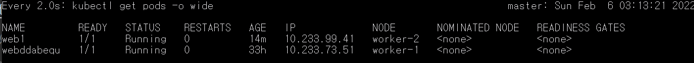
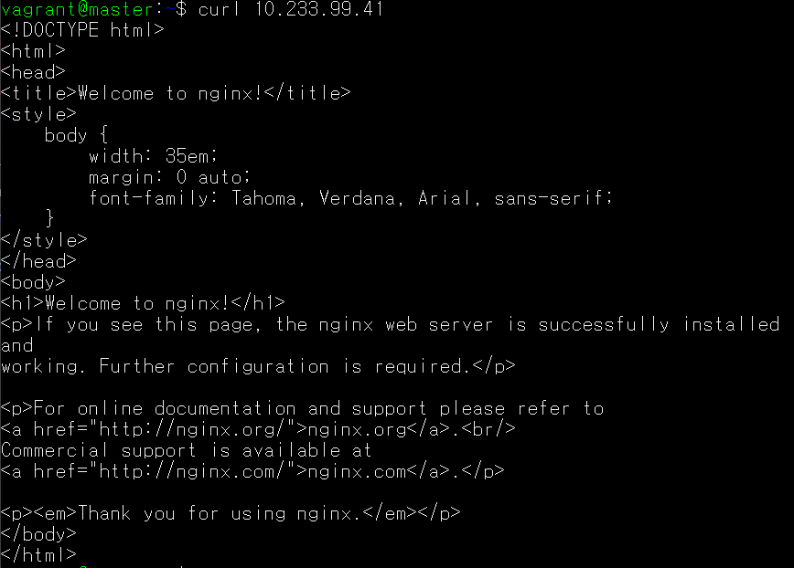

### Pod란?
- 컨테이너를 표현하는 k8s API의 최소단위
- Pod에는 하나 또는 여러 개의 컨테이너가 포함될 수 있음

### Pod 생성하기
1. kubectl run 명령(CLI)으로 생성

```
$ kubectl run webserver --image=nginx:1.14
```

2. pod yaml을 이용해 생성


<br>

***명령어 정리***


1. watch [명령어] : watch 뒤의 명령어를 2초마다 한번씩 실행
(실시간으로 파드 상태를 확일할 때 유용함)

```
$ watch kubectl get pods -o wide
```

*실제 실행 화면*



<br>

2. curl [ip] : command라인에서 웹 브라우저를 보여주는 명령어

*실제 실행화면*



### multi-container Pod 생성

```
apiVersion: v1
kind: Pod
metadata:
 name: multipod
spec:
 containers:
 - name: nginx-container  #containers의 name이 2개임
   image: nginx:1.14
   ports:
   - containerPort: 80
 - name: centos-container
   image: centos:7
   command:
    - sleep
    - "10000"
```
